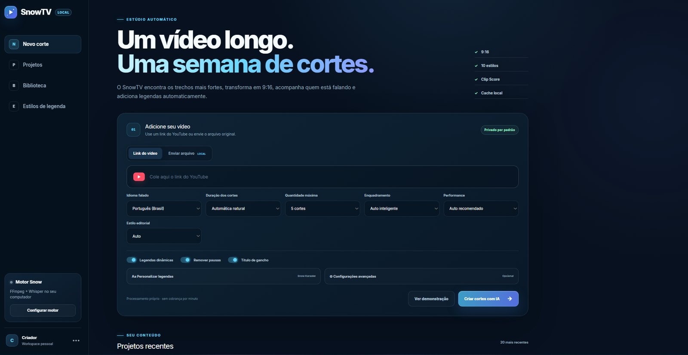
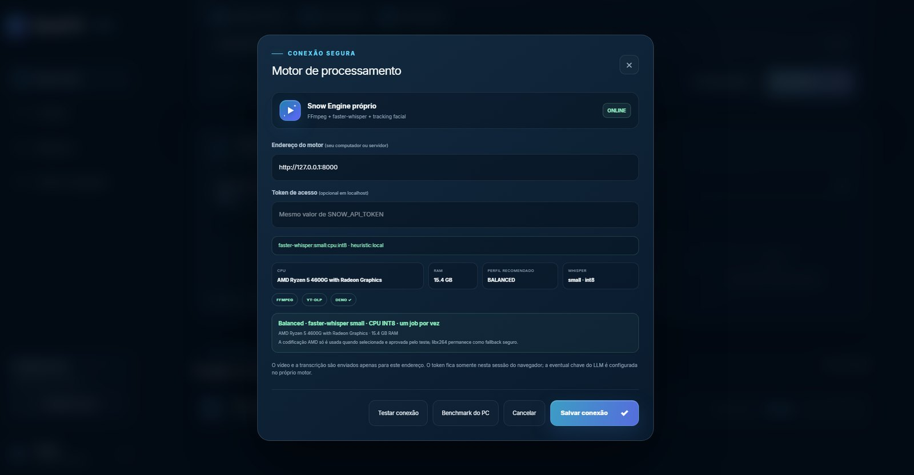
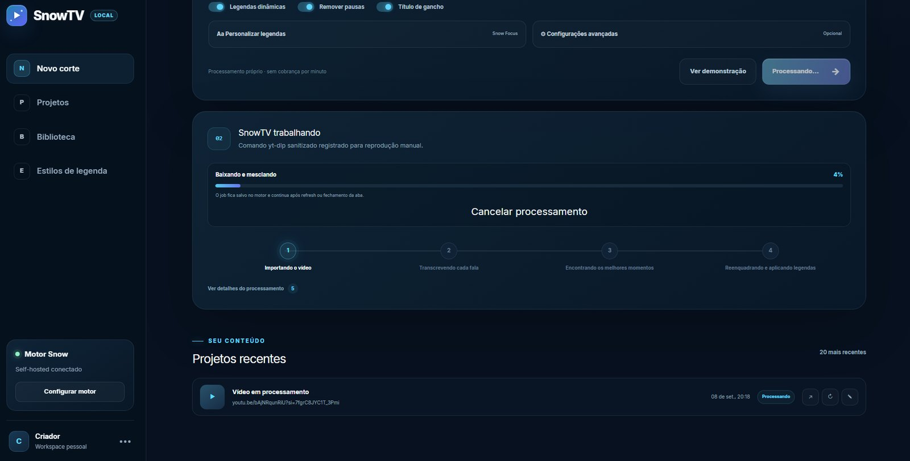
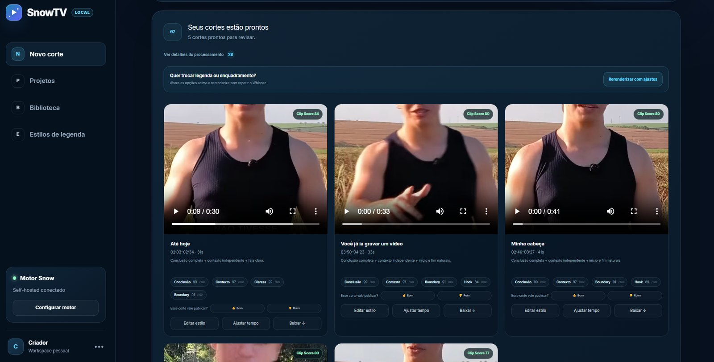
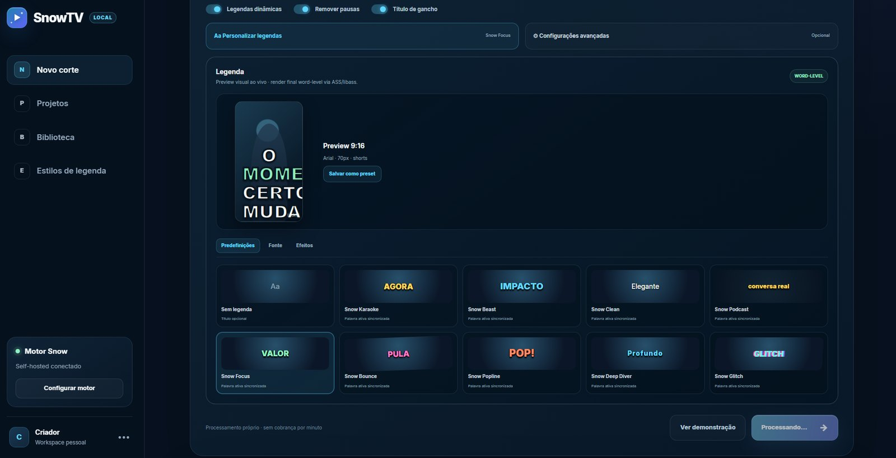

# SnowTV

**Gerador local de cortes verticais para Shorts, Reels e TikTok.**

O SnowTV transforma vídeos longos em cortes 9:16 prontos para redes sociais usando um pipeline local de processamento. A proposta é oferecer uma alternativa self-hosted a ferramentas que cobram por minuto, mantendo controle sobre arquivos, caches e renderizações.

O projeto combina **Python, FastAPI, React/TypeScript, faster-whisper, OpenCV, FFmpeg e yt-dlp**. O fluxo principal funciona sem API paga; integrações com LLM compatível com OpenAI ou Ollama são opcionais.

> **Status:** fluxo principal validado em Windows com processamento local em CPU. A suíte automatizada do backend possui **40 testes aprovados**.

## Demonstração real

### Resultado gerado pelo SnowTV

O vídeo abaixo foi criado pelo próprio pipeline do projeto: seleção automática do trecho, tracking facial, reenquadramento para 9:16, legendas dinâmicas e render final.

[](docs/demo/snowtv-demo.mp4)

**[▶ Assistir ao vídeo completo](docs/demo/snowtv-demo.mp4)**

**Saída validada:** 1080 × 1920, 30 fps.

### Interface

| Novo corte | Motor local |
| --- | --- |
|  |  |

| Processamento | Cortes gerados |
| --- | --- |
|  |  |

### Editor de legendas



## O que o SnowTV faz

- importa vídeos locais ou baixa conteúdo com `yt-dlp`;
- extrai áudio e metadados com FFmpeg/FFprobe;
- transcreve falas com timestamps por palavra usando `faster-whisper`;
- identifica trechos com maior potencial editorial;
- reduz cortes repetitivos por similaridade temporal e semântica;
- ajusta automaticamente início e fim dos cortes;
- acompanha rostos e reenquadra para 9:16;
- usa crop central como fallback quando o tracking não é confiável;
- gera legendas ASS animadas e personalizáveis;
- oferece presets e editor visual de legendas;
- renderiza H.264/AAC com FFmpeg;
- persiste jobs e reaproveita caches;
- permite cancelar, retomar e rerenderizar jobs sem refazer etapas válidas.

## Pipeline


## Arquitetura

```text
SnowTV/
├── app/                     # interface React/TypeScript
├── engine/                  # Snow Engine (FastAPI/Python)
│   ├── snow_engine/         # pipeline, API, jobs, tracking e render
│   ├── tests/               # testes automatizados do backend
│   └── data/                # ignorado pelo Git; jobs, caches e SQLite
├── db/                      # persistência local da interface
├── worker/                  # entry point da interface
├── docs/                    # screenshots, validação e testes
└── tests/                   # testes do frontend/contratos
```

A interface envia um job ao **Snow Engine**. O backend executa as etapas pesadas em CPU, mantém o estado localmente e devolve progresso, logs e resultados pela API.

A persistência da interface usa um banco local D1/SQLite. Em uma instalação nova, a estrutura necessária é criada automaticamente na primeira utilização, evitando um passo manual de migração apenas para abrir e usar a aplicação localmente.

## Stack

### Backend e processamento

- Python 3.11/3.12
- FastAPI
- SQLite
- faster-whisper
- OpenCV
- FFmpeg / FFprobe / libass
- yt-dlp

### Interface

- React
- TypeScript
- Next/Vinext
- Vite
- Drizzle ORM

### Execução

- Windows via PowerShell
- Docker CPU
- perfil NVIDIA opcional
- cache local de pipeline

## Recursos técnicos

### Seleção editorial

O Editorial Engine usa ranking com componentes como hook, contexto, conclusão, clareza, emoção, novidade, ritmo e qualidade de boundary. A seleção final combina qualidade e diversidade para reduzir cortes semanticamente repetitivos.

### Tracking e reenquadramento

O pipeline usa proxy leve para análise facial, redetecção periódica, tracking entre detecções, smoothing e reset após mudanças fortes de cena. Quando o tracking não é confiável, o job continua com crop central seguro em vez de falhar.

### Legendas

As legendas finais são renderizadas em ASS/libass, com presets, destaque por palavra, safe zones, controle de fonte, tamanho, posição, contorno, fundo, cores e efeitos.

Durante o teste real foi identificado e corrigido um caso em que o **título de gancho e a legenda dinâmica apareciam juntos no início**. A regra atual dá prioridade visual ao gancho e só libera a legenda dinâmica depois que ele termina.

### Cache e retomada

O SnowTV reaproveita mídia, metadados, transcrição, seleção editorial, proxies e tracking. Isso permite alterar legenda, enquadramento ou cortes sem retranscrever o vídeo inteiro.

## API principal do Snow Engine

| Método | Endpoint | Finalidade |
| --- | --- | --- |
| `GET` | `/health` | hardware e dependências |
| `GET` | `/api/capabilities` | capacidades e presets |
| `POST` | `/api/process` | processar URL |
| `POST` | `/api/process/upload` | processar upload |
| `GET` | `/api/status/{job_id}` | progresso e resultado |
| `GET` | `/api/jobs` | listar projetos locais |
| `POST` | `/api/jobs/{job_id}/rerender` | rerender usando caches |
| `POST` | `/api/jobs/{job_id}/cancel` | cancelar job |
| `POST` | `/api/jobs/{job_id}/resume` | retomar job |
| `DELETE` | `/api/jobs/{job_id}` | remover job e saídas |

## Início rápido no Windows

### Requisitos

- Windows 10/11;
- Python 3.11 ou 3.12;
- Node.js 22.13 ou superior;
- FFmpeg e FFprobe no `PATH`;
- Deno opcional para alguns fluxos do YouTube.

Na raiz do projeto:

```powershell
Set-ExecutionPolicy -Scope Process Bypass
.\start-snowtv.ps1
```

O launcher prepara a `.venv` quando necessário, instala dependências Node na primeira execução, inicia FastAPI e frontend e abre a interface no navegador. A persistência local da interface também é preparada automaticamente quando a aplicação é usada pela primeira vez.

## Desempenho validado

O fluxo principal foi testado em uma máquina sem GPU NVIDIA dedicada:

| Item | Configuração |
| --- | --- |
| CPU | Ryzen 5 4600G |
| RAM | 16 GB |
| Whisper | `small` |
| Dispositivo | CPU |
| Compute | `int8` |
| Threads Whisper | 8 |
| Encoder | `libx264` |
| Saída | 1080 × 1920, 30 fps |

No teste real, um job com cinco cortes concluiu download, transcrição, seleção, tracking e render localmente.

## Testes e validação

```bash
PYTHONPATH=engine python3 -m unittest discover -s engine/tests -v
python3 -m compileall -q engine/snow_engine
npx tsc --noEmit
npm test
```

Resultados registrados:

```text
Python: 40 testes aprovados
TypeScript: OK
ESLint: OK
Frontend build: OK
Node tests: 2 OK
```

Veja os detalhes em [docs/testing/VALIDATION.md](docs/testing/VALIDATION.md).

## Privacidade

- processamento principal local;
- nenhuma API paga obrigatória;
- `.env`, caches, jobs, outputs e banco local são ignorados pelo Git;
- chaves opcionais devem permanecer apenas em `.env`;
- para uso em rede, configure token, HTTPS, firewall e CORS restrito.

## Limitações atuais

- tracking depende da composição e qualidade do vídeo;
- split automático com duas pessoas ainda precisa de mais validação real;
- cancelamento de processos externos ocorre de forma cooperativa;
- preview de legenda não é pixel-perfect em relação ao libass;
- cancelamento e retomada ainda merecem mais testes manuais recorrentes.

## Roadmap

- ampliar testes com múltiplos interlocutores;
- medir consumo de RAM e tempo em diferentes perfis;
- melhorar tracking e decisão automática de split;
- expandir testes end-to-end.

## Documentação

- [Arquitetura](docs/ARCHITECTURE.md)
- [Validação](docs/testing/VALIDATION.md)
- [Teste manual no Windows](docs/testing/MANUAL_TEST_WINDOWS.md)
- [Histórico de mudanças](CHANGELOG.md)

---

Projeto criado como ferramenta de uso próprio para automatizar a produção de cortes verticais sem depender de cobrança recorrente por minuto de vídeo.
