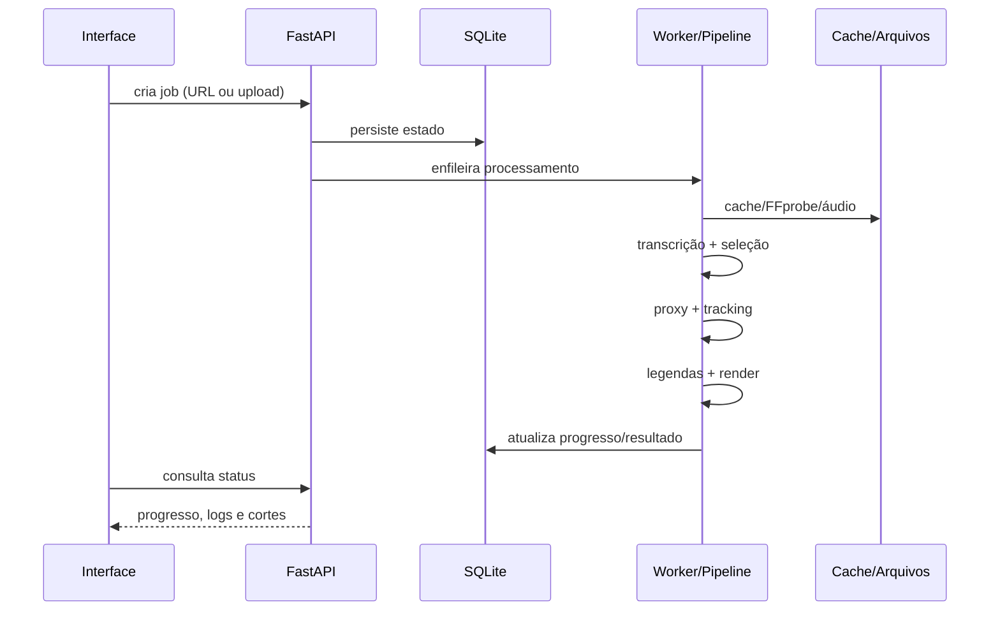

# Arquitetura do SnowTV

## Visão geral

O SnowTV é dividido em duas partes principais:

1. **Interface** em React/TypeScript, responsável por configuração, envio de jobs, acompanhamento e editor visual.
2. **Snow Engine** em FastAPI/Python, responsável por download/importação, transcrição, seleção editorial, tracking, legendas, renderização, persistência e cache.

## Fluxo de processamento

## Persistência

O backend usa SQLite para estado dos jobs e feedbacks. Artefatos pesados ficam em diretórios locais ignorados pelo Git. O cache é granular para evitar repetir etapas caras.

## Princípios do projeto

- processamento local por padrão;
- fallback em vez de falha quando tracking não é confiável;
- reaproveitamento de caches;
- jobs persistentes e retomáveis;
- heurística offline como caminho padrão;
- aceleração por hardware opcional, não obrigatória.
